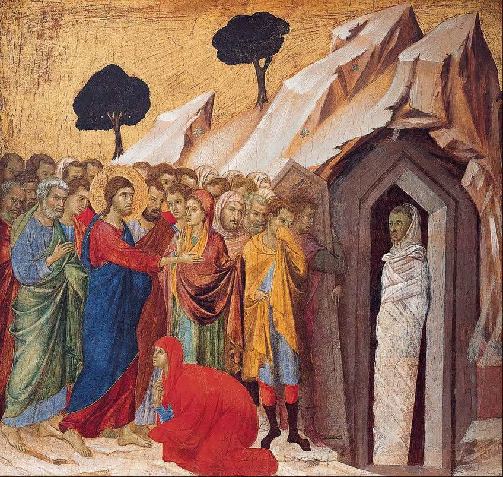
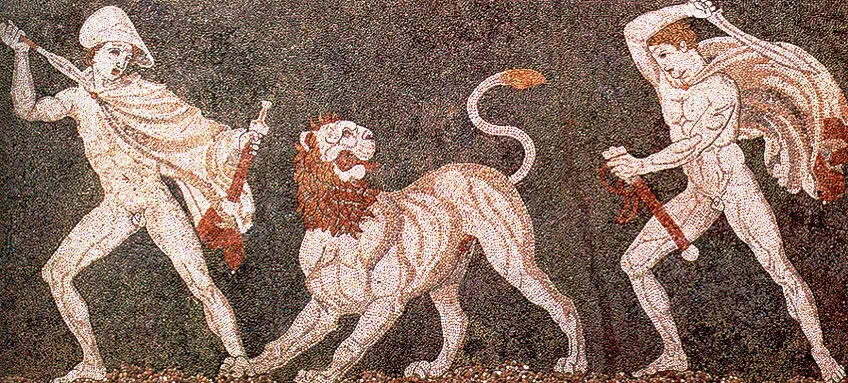
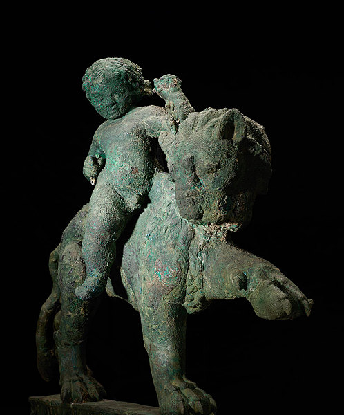
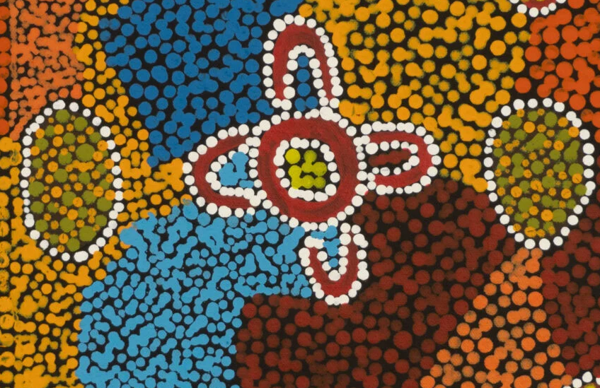

# Computer Vision Blog Post #1

I was curious about how well ChatGPT is able to date pieces of artwork when uploaded and prompted "Can you date this artwork for me?". I expected it to do a good job but I was surprised at just how much detail it is able to give.

The first image I gave it was Altar frontal from Avià, c. 1200.

It correctly guessed that the painting was created sometime between the 12th and 13th century. It also identified the style of painting correctly, Romanesque. It was able to describe the subjects of the painting, as well as compare and contrast the composition of the painting to others made during that time.

For the second painting, I decided to give it something made in a similiar time period to the previous one but in a different style. I chose The Raising of Lazarus by Giotto Duccio, c. 1310

Again, ChatGPT knocked it out of the park. Not only did it correctly guess the style and period of the artwork, it guessed who the artist likely was. I figured I was making its job easy by giving it famous European paintings that have probably been studied extensively by art history nerds; so I decided to go back in time by a lot and change the medium of artwork. The artwork I gave it was a mosaic from ancient Greece.

If it struggled more with this artwork, it didn't show it. It correctly identified the medium as mosaic and the culture and period as hellenistic around the 4th century BCE. It even guessed that the mosaic was probably found in the city of Pella.

At this point I wanted to stump ChatGPT, so I decided to throw it a curveball. I gave it an image of a bronze statue that was made in Yemen in the 1st century CE.

This finally tripped it up! It correctly guessed the time period it was from but guessed that it was made by a mediterranean power. This is technically wrong but not the craziest mistake to make. At the time Yemeni artists were making art with heavy influences from their trading partners, which included mediterranean powers.

Finally, I wanted to try a modern piece of art with ancient origins to see if it would have a harder time. I chose a painting by an Aboriginal man created this year but using styles much older.

It identified it accurately as part of the resurgence of Aboriginal art that has been a movement since the 1970s.

From my queries it is clear that ChatGPT has absolutely no problem accurately identifying and dating pieces of artwork. I expected it to struggle with artwork from artwork outside of the western world but it didn't falter with the queries I came up with. With enough time I'm sure I could find something it would falter on.
